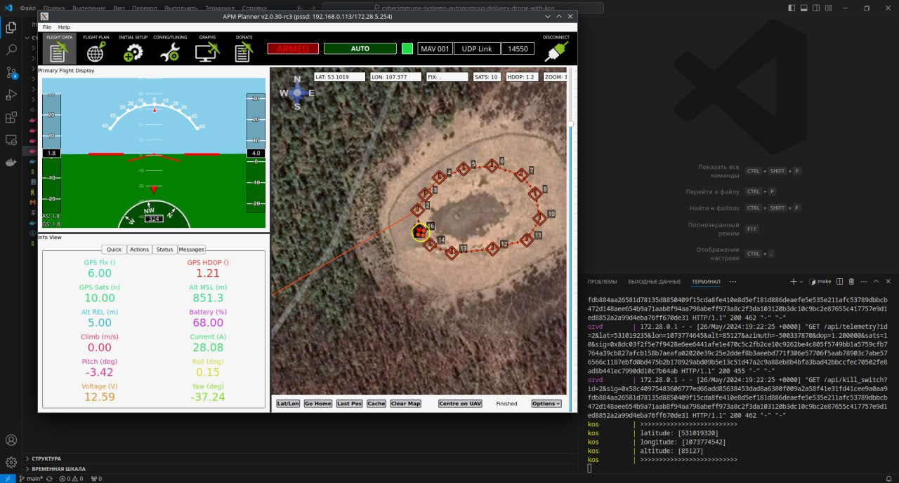
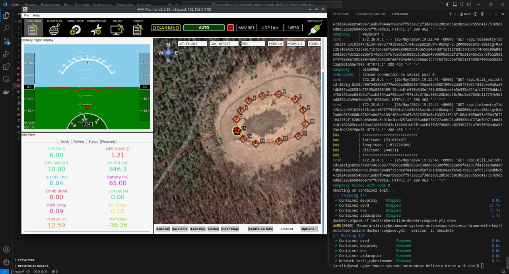

# Киберимунный автономный квадрокоптер

Проект представляет собой набор инструментов и решений для создания киберимунного автономного квадрокоптера. Состоит из [ОрВД](orvd) и [наземной станции](planner), [прошивки для квадрокоптера](ardupilot), [симулятора](ardupilot), [модуля безопасности](kos), [документации](docs).

Содержание репозитория:

- [/ardupilot](ardupilot) - прошивка для квадрокоптера и симулятор
- [/docs](docs) - документация
- [/kos](kos) - модуль безопасности
- [/orvd](orvd) - Система организации воздушного движения
- [/planner](planner) - APM Planner 2 под Linux (наземная станция)
- [/tests](tests) - тесты проекта

### Запуск цифрового двойника при помощи docker контейнеров и docker-compose

Данный способ подходит для любых Linux систем (включая запущенные в VirtualBox или в Windows WSL2).
Все компоненты цифрового двойника запускаются в контейнере. Планировщик с графическим интерфейсом может запускается как на хост системе так и на другом компьютере имеющим доступ к данному по сети.

#### Пример установки пакетов и запуска цифрового двойника для Ubuntu 22.04 (название пакетов в других дистрибутивах по аналогии)

Установка пакетов

```bash
# Получение информации о свежих версиях пакетов для дистрибутива
sudo apt-get update

# Установка необходимых пакетов
sudo apt-get install -y git make docker-compose docker.io libfuse2

# Удаление ненужных пакетов
sudo apt-get remove modemmanager -y

# Добавления пользователя user в нужные группы
sudo usermod -aG sudo,docker,dialout user

# Клонирование репозитория с симулятором (вместо cyberimmunity-edu может быть ваш fork)
git clone https://github.com/cyberimmunity-edu/cyberimmune-systems-autonomous-delivery-drone-with-kos.git

# Размещение KasperskyOS CE SDK 1.2 в папке проекта (копия репозитория)
cp ~/Downloads/KasperskyOS-Community-Edition-1.2.0.45.zip cyberimmune-systems-autonomous-delivery-drone-with-kos/
```

Запуск цифрового двойника:

```bash
# Запуск контейнеров с ОРВД, SITL симулятором, компонентом на KasperskyOS, планировщиком MAVProxy 
cd cyberimmune-systems-autonomous-delivery-drone-with-kos
make online
```

#### Запуск APM Planner 2

В новом терминале или запустив по иконке:

```bash
cd planner/
./APM_Planner.AppImage 
```

### Результаты
Дрон летит по маршруту и координаты выводятся в журнал


=======
- [API](docs/API.md) - программный интерфейс модуля безопасности.
- [Архитектура](docs/ARCHITECTURE.md) - архитектурные диаграмы помогающие понять проект.
- [Разработка](docs/DEVELOPMENT.md) - документация для разработчика помогающая работать с проектом (установка, настройка, запуск).
- [Соревнования](docs/COMPETITION.md) - описание соревнований для участников **Киберимунной автономности** на [Архипелаге 2024](https://xn--2035-43davo0a5a6bk9d.xn--p1ai/).
- [Квалификация](docs/QUALIFICATION.md) - квалификационные задания для участников **Киберимунной автономности** на [Архипелаге 2024](https://xn--2035-43davo0a5a6bk9d.xn--p1ai/).
- [Инструменты](docs/TOOLS.md) - описание инструментов входящих в решение и полезные материалы по работе с ними.
