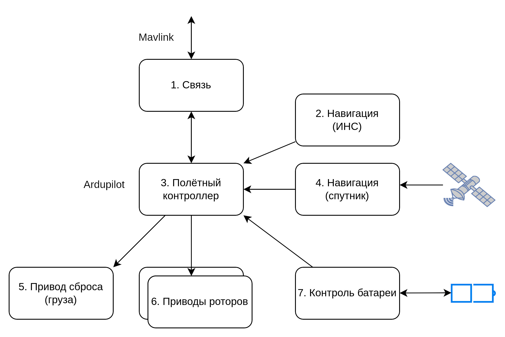
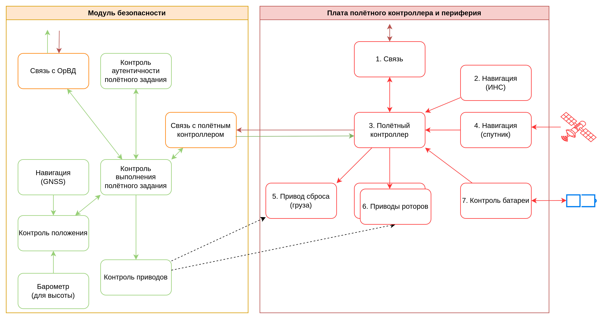
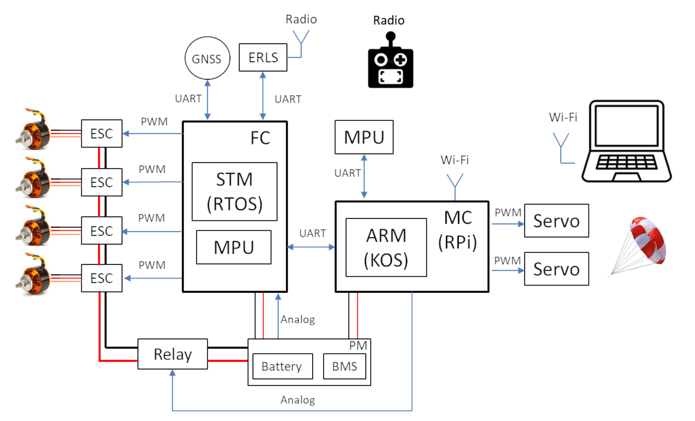
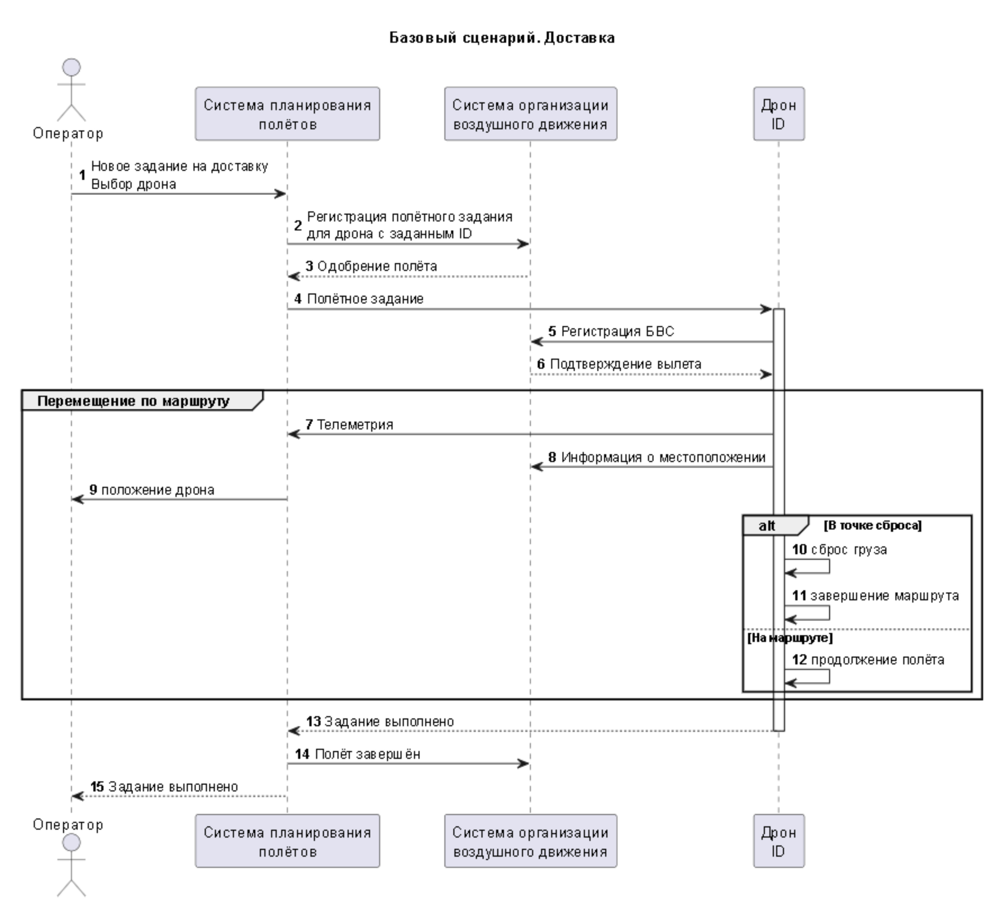
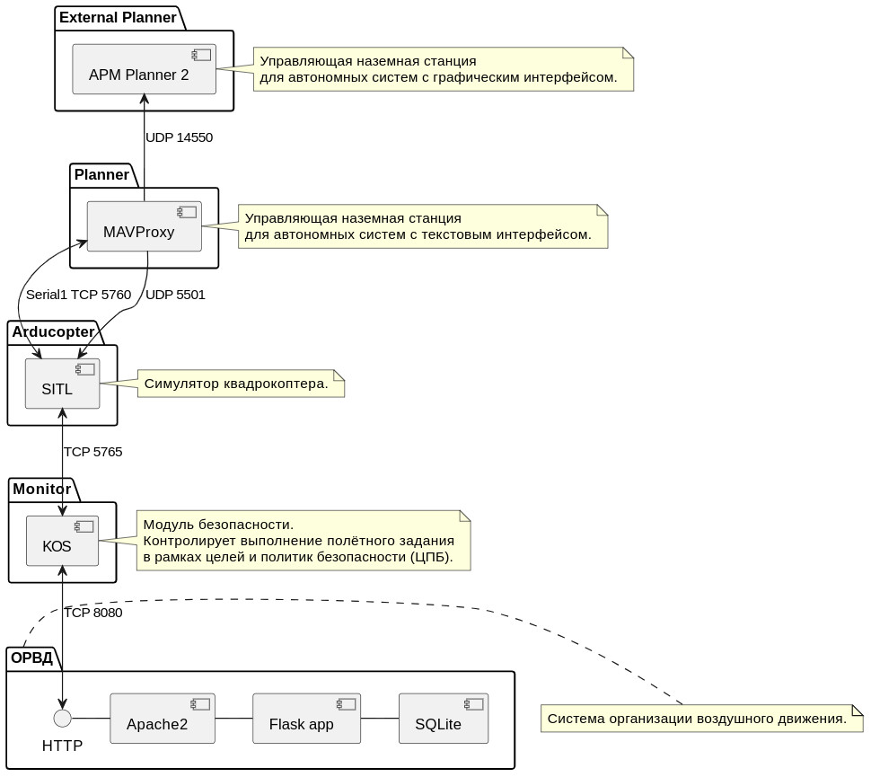
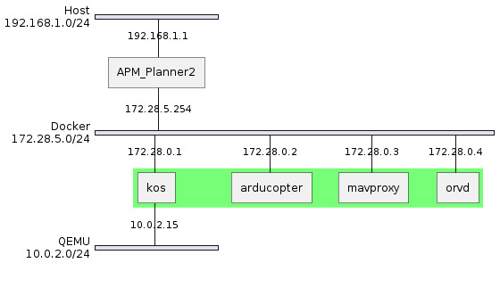

# Кибериммунный автономный квадрокоптер-доставщик

Оглавление:

- [Анализ ключевых ценностей и ущербов для квадрокоптера-доставщика](#анализ-ключевых-ценностей-и-ущербов-для-квадрокоптера-доставщика)
- [Цели безопасности](#цели-безопасности)
- [Предположения безопасности](#предположения-безопасности)
- [Высокоуровневая (некибериммунная) архитектура квадрокоптера-доставщика](#высокоуровневая-некибериммунная-архитектура-квадрокоптера-доставщика)
- [Политика архитектуры](#политика-архитектуры)
- [Функциональная (киберимунная) архитектура](#функциональная-киберимунная-архитектура)
- [Базовый сценарий: доставка](#базовый-сценарий-доставка)
- [Цифровой двойник](#цифровой-двойник)

## Анализ ключевых ценностей и ущербов для квадрокоптера-доставщика

| №   | Ценность | Негативные события | Оценка ущерба | Комментарий |
| --- | -------- | ------------------ | ------------- | ----------- |
| 1 | Люди     | причинён вред здоровью людей в результате физического контакта |  критический | контакт, например, в результате падения или тарана. Уголовное наказание, выплата компенсаций, репутационные издержки |
| 2 | Имущество третьих сторон | причинён ущерб имуществу в результате физического контакта | критический | включая критическую инфраструктуру и другие воздушные суда. Возможна комбинация с №1. Штрафы, репутационные издержки |
| 3 | Дрон | утрата оборудования в результате падения, столкновения с препятствием или другим аппаратом | средний | необходимо учитывать эффект масштаба при оценке этого ущерба, т.к. возможна утрата сразу всех дронов в результате успешной кибератаки. Бизнес считает, что сами дроны можно не очень дорого застраховать |
| 4 | Груз | утрата груза или получение его неавторизованным лицом | средний | необходимо учитывать специфику груза. В текущем проекте рассматриваются коммерческие грузы, которые можно не очень дорого застраховать |

## Цели безопасности

1. Выполняются только аутентичные полётные задания.
2. Выполняются только авторизованные системой ОрВД задания, при этом статус авторизации может быть изменён в процессе выполнения задания.
3. Все операции, включая место сброса груза, выполняются согласно ограничениям в полётном задании.
4. В случае критического отказа дрон снижается вертикально со скоростью не более 1 м/с.
5. Для запроса авторизации вылета к системе ОрВД используется только аутентичный идентификатор дрона.

## Предположения безопасности

- аутентичная система ОрВД благонадёжна
- аутентичные сотрудники благонадёжны и обладают необходимой квалификацией
- только авторизованные сотрудники управляют системой управления полётами
- аутентичное полётное задание составлено так, что на всём маршруте дрон может совершить аварийную посадку без причинения неприемлемого ущерба

## Высокоуровневая (некибериммунная) архитектура квадрокоптера-доставщика

## Политика архитектуры

## Функциональная (киберимунная) архитектура

## Базовый сценарий: доставка

## Цифровой двойник

### Сетевое взаимодействие

