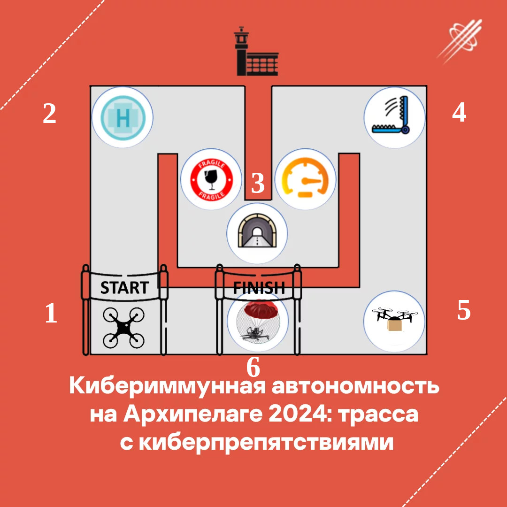

# Соревнования: Кибериммунная автономность на Архипелаге 2024

Оглавление:

- [Цель и смысл соревнований](#цель-и-смысл-соревнований)
- [Трасса с киберпрепятствиями](#трасса-с-киберпрепятствиями)
- [Киберпрепятствия](#киберпрепятствия)
- [Ограничения на используемое ПО и оборудование дронов](#ограничения-на-используемое-по-и-оборудование-дронов)
- [Ответственность за сохранность дронов](#ответственность-за-сохранность-дронов)
- [Уровни участия и оценка результатов](#уровни-участия-и-оценка-результатов)
- [Кодекс Этики](#кодекс-этики)
- [Протесты](#протесты)

## Цель и смысл соревнований

Инженерные соревнования - площадка для апробации возможных решений по обеспечению устойчивости дронов к кибератакам, сегодняшним и завтрашним.

Соревнования состоят из подготовительного этапа где участники пишут код для модуля безопасности автономного квадрокоптера, делающего его устойчивым к возможным кибератакам, и очного этапа. В ходе очного этапа соревнований квадрокоптер в автономном режиме должен пройти дистанцию и выполнить необходимые элементы трассы, несмотря на кибератаки, которые постараются этому помешать.

## Трасса с киберпрепятствиями

 1. Старт
 2. Место приземления (тут получается разрешение на прохождение трассы)
 3. Ворота или арка (возможно из сетки)
 4. Несанкционированный перехвад груза
 5. Точка доставки груза
 6. Место аварийного приземления

К моменту начала очных этапов соревнований соревнований расположение и количество элементов может быть изменено для создания элемента неожиданности.

Организаторы предоставят участникам координатные точки финальной трассы.

## Киберпрепятствия

Что может произойти (пример):

- искажение координат,
- случайные команды на привод сброса,
- искажение полётного задания,
- превышение скорости (как горизонтальной, так и вертикальной),
- уход с маршрута.

Работая в симуляторе "цифровой двойник" не забывайте, что вы имеете дело с реальным физическим объектом на который могут оказывать влияние множество факторов среды. Важно не забывать об утверждённых целях и политиках безопасности.

## Ограничения на используемое ПО и оборудование дронов

Разрешается:

- модифицировать любым образом модуль безопасности в составе ПО дрона.

Запрещается:

- менять любые компоненты полетного контроллера, предоставленные организаторами;
- использовать прошивки программного обеспечения дрона, приводящие к использованию во время прохождения дистанции любой версии ПО полетного контроллера, отличающейся от предоставленной организаторами всем участникам;
- использовать в коде проверки, которые определяют наступление того или иного кибер-препятствия за счет знания исходного кода полетного контроллера или иных, кроме модуля безопасности, частей системы;
- отключать код, приводящий к возникновению кибер-препятствий;
- использовать любые средства воздействия на дрон во время прохождения дистанции, кроме заранее установленной на дрон прошивки;
- использовать любые методы ручного управления дроном, кроме аварийных, вызванных требованиями безопасности;

В случае нарушения любого из этих пунктов команда может быть дисквалифицирована или оштрафована.

Требуется:

- завершить работу над дроном не позже указанного времени "Сдачи прошивок";
- передать организаторам разработанную прошивку (и исходный код), которая будет использоваться во время зачетных попыток;
- продемонстрировать в составе своей прошивки совпадение контрольных сумм и целостность полетного контроллера, предоставленного организаторами всем участникам;
- перед выходом на трассу продемонстрировать успешную цепочку: загрузка полетного задания, согласование с ОрВД, старт миссии, прерывание полета по команде ОрВД (отключение моторов);
- представить жюри полные исходные коды ПО дрона;
- предоставить полные логи-трейсы прохождения трассы после соревнований.

## Ответственность за сохранность дронов

Если во время очной подготовки дрон приходит в неисправное состояние, команда осуществляет ремонт самостоятельно. При получении дрона команда должна удостовериться, что получила исправное оборудование, после чего претензии команды по состоянию оборудования не принимаются..

Все время соревнований дроны должны находится на территории проведения соревнований - ангаре или трассе.

## Уровни участия и оценка результатов

В программе соревнований предусматриваются следующие уровни участия:

- Начальный. работа с симуляторами (цифровым двойником) - блокировка нарушение целей безопасности, доработка алгоритмов.
- Средний. работа с готовыми программно-аппаратными компонентами - интеграция в летающий комплекс.
- Продвинутый. проектирование собственных программно-аппаратных компонентов и интеграция в предложенную платформу; замена отдельных узлов с использованием заданных программных интерфейсов (для взаимодействия с бортовыми и наземными системами)

В зависимости от количества и заявленного уровня участия участников, организаторы могут до начала зачетных попыток всех команд убрать из зачетных попыток некоторые уровни соревнований, если окажется, что в таком уровне участников.

Рейтинг команд-участников будет составляться на основе следующих критериев:

- Количество успешно пройденных препятствий (завершившихся доставкой груза в точку доставки или определяемой правилами контролируемой аварийной посадкой) в зависимости от сложности кибер-препятствия (1-100 баллов за препятствие). Чем больше препятствий, тем больше баллов. Баллы за все пройденные препятствия суммируются.
- Уровень участия. Чем выше уровень, тем больше баллов дается за каждое пройденное препятствие.
- Суммарное время прохождения всех успешно пройденных препятствий. Чем меньше суммарное время, тем лучше.

Победители определяются по максимальному количеству баллов, а при равном количества баллов - по минимально суммарному времени прохождения.

Окончательный список баллов за каждое препятствие и уровень, формула расчета баллов объявляется организаторами командам перед началом тестовых попыток.

## Кодекс Этики

Миссия соревнований - вдохновить разработчиков на обучение дисциплинам, связанным с дронами, создание своих собственных проектов, а также развитие навыков и обмен опытом посредством участия в соревнованиях. Вот почему следующие аспекты являются ключевыми для всех наших соревнований и должны строго соблюдаться всеми лицами, задействованными в мероприятии:

1. Все лица, задействованные в мероприятии, обязаны быть вежливыми и открытыми друг с другом.
2. Организаторы, судьи, участники, тренеры и другие задействованные лица обязаны обеспечить честное и справедливое соревнование для всех участников.
3. Участники должны воздерживаться от любый действий, способных повлиять на результаты других участников.
4. Участники должны уважать окончательное решение судей и соблюдать субординацию.
5. Болельщики могут помогать, направлять и вдохновлять участников во время подготовки к соревнованиям, но создавать и программировать дрон вместо участников во время соревнований строго запрещено.

Во время проведения зачетных попыток не допускается использование любых средств, которые могут дать нечестное преимущество перед другими участниками.

## Протесты

Протест в отношении результатов соревнований (решений судей и полевых арбитров) подается капитаном команды в письменной форме в течение 30 минут с момента вынесения судейского решения.

Диалог от лица команды ведет капитан команды; жалобы, исходящие от других членов команды, рассмотрению не подлежат.
