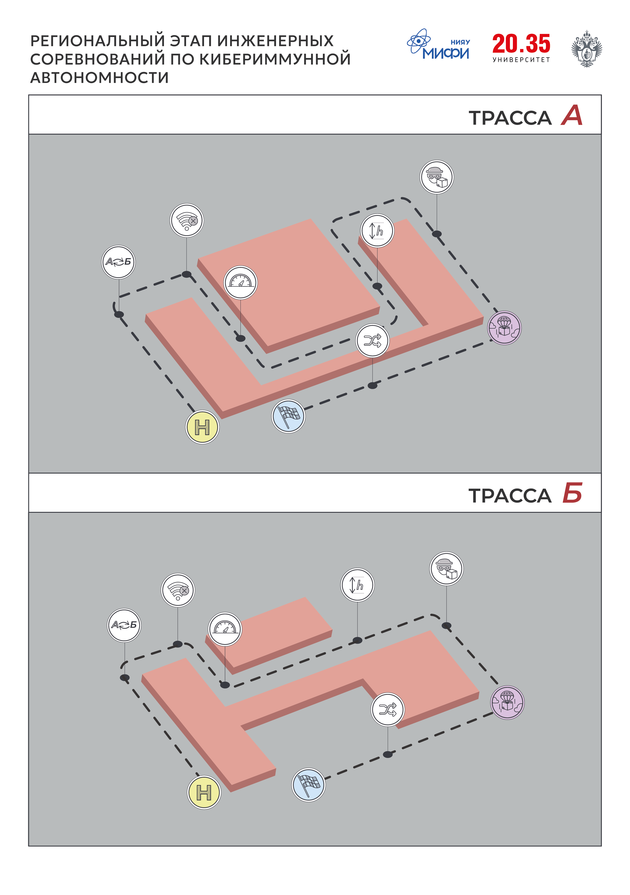
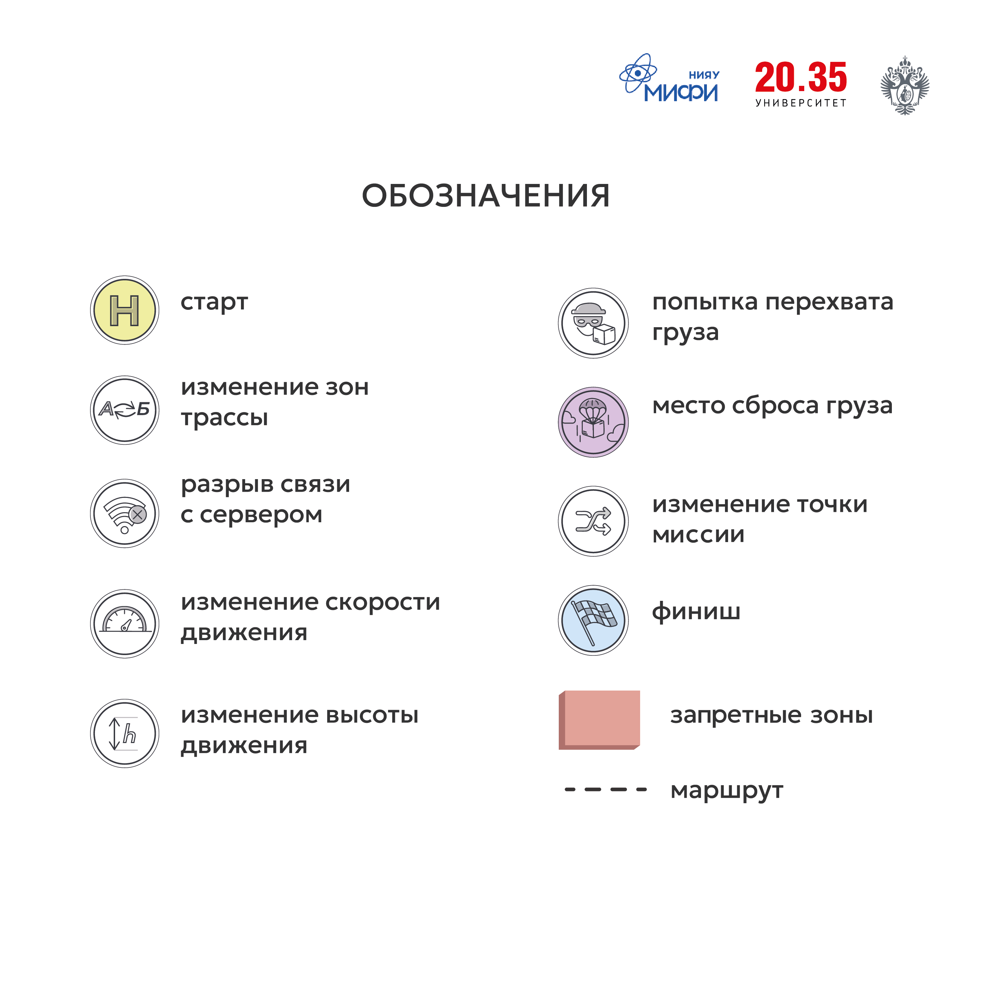

# Соревнования: Региональный этап инженерных соревнования по Кибериммунной автономности, Москва, 2025

Оглавление:

- [Цель и смысл соревнований](#цель-и-смысл-соревнований)
- [Трасса с киберпрепятствиями](#трасса-с-киберпрепятствиями)
- [Киберпрепятствия](#киберпрепятствия)
- [Ограничения на используемое ПО и оборудование дронов](#ограничения-на-используемое-по-и-оборудование-дронов)
- [Ответственность за сохранность дронов](#ответственность-за-сохранность-дронов)
- [Уровни участия и оценка результатов](#уровни-участия-и-оценка-результатов)
- [Кодекс Этики](#кодекс-этики)
- [Протесты](#протесты)

## Цель и смысл соревнований

Инженерные соревнования - площадка для апробации возможных решений по обеспечению устойчивости дронов к кибератакам, сегодняшним и завтрашним.

Соревнования состоят из подготовительного и очного этапов. Подготовительный этап предназначен для проверки у участников знаний технологий, требуемых для очного этапа. В ходе очного этапа соревнований квадрокоптер в автономном режиме должен пройти дистанцию и выполнить необходимые элементы трассы, несмотря на кибератаки, которые постараются этому помешать.

## Трасса с киберпрепятствиями

К моменту начала очных этапов соревнований расположение и количество элементов может быть изменено для создания элемента неожиданности.

Координатные точки трассы участникам не предоставляются, будет организован доступ к трассе для осуществления измерений.

## Киберпрепятствия

Что может произойти (пример):

- искажение координат,
- случайные команды на привод сброса,
- искажение полётного задания,
- превышение скорости (как горизонтальной, так и вертикальной),
- уход с маршрута,
- изменение конфигурации зон запрещённых для полёта,
- обрыв связи с сервером.

Работая в цифровом двойнике не забывайте, что на реальной трассе вы будете иметь дело с реальным физическим объектом, на который могут оказывать влияние множество факторов среды. Также важно не забывать об утверждённых целях и политиках безопасности.

## Ограничения на используемое ПО и оборудование дронов

Разрешается:

- модифицировать любым образом модуль безопасности в составе ПО дрона.

Запрещается:

- менять любые компоненты полетного контроллера, предоставленные организаторами;
- использовать прошивки программного обеспечения дрона, приводящие к использованию во время прохождения дистанции любой версии ПО полетного контроллера, отличающейся от предоставленной организаторами всем участникам;
- использовать в коде проверки, которые определяют наступление того или иного киберпрепятствия за счет знания исходного кода полетного контроллера или иных, кроме модуля безопасности, частей системы;
- отключать код, приводящий к возникновению киберпрепятствий;
- использовать любые средства воздействия на дрон во время прохождения дистанции, кроме заранее установленной на дрон прошивки;
- использовать любые методы ручного управления дроном, кроме аварийных, вызванных требованиями безопасности;

В случае нарушения любого из этих пунктов команда может быть дисквалифицирована или оштрафована.

Требуется:

- завершить работу над дроном не позже объявленного времени сдачи прошивок;
- передать организаторам разработанную прошивку, которая будет использоваться во время зачетных попыток;
- продемонстрировать в составе своей прошивки совпадение контрольных сумм и целостность полетного контроллера, предоставленного организаторами всем участникам;
- перед выходом на трассу продемонстрировать успешное выполнение следующей последовательности действий: загрузка полетного задания, его согласование с ОрВД, старт миссии, прерывание полета по команде ОрВД (отключение моторов);
- представить жюри полные исходные коды ПО модуля безопасности дрона;
- предоставить полные логи-трейсы прохождения трассы.

## Ответственность за сохранность дронов

Если во время очной подготовки дрон приходит в неисправное состояние, команда осуществляет ремонт самостоятельно. При получении дрона команда должна проверить, что получила исправное оборудование, после чего претензии команды по состоянию оборудования не принимаются.

Все время соревнований дроны должны находится на территории проведения соревнований.

## Уровни участия и оценка результатов

В программе соревнований предусматриваются следующие уровни участия:

- Начальный. Работа на компьютерах с симуляторами (цифровым двойником): поиск и устранение уязвимостей, разработка новых алгоритмов согласно сценарию соревнований, отработка базовых навыков работы со станцией наземного управления полетами и алгоритмов взаимодействия с системой организации воздушного движения.
- Основной. Включает в себя «начальный» этап соревнований дополненный реальными полетами БАС по предложенной трассе.

В зависимости от количества и заявленного уровня участия участников, организаторы могут до начала зачетных попыток всех команд убрать из некоторые уровни соревнований, если окажется, что в них не набралось достаточное количество участников.

Рейтинг команд-участников будет составляться на основе критериев представленных в документе [Критерии оценки команд на соревнованиях](docs/ASSESSMENT.md).

Победители определяются по максимальному количеству баллов, а при равном количестве баллов - по минимально суммарному времени прохождения трассы.

Окончательная формула расчета баллов объявляется организаторами командам перед началом тестовых попыток.

## Кодекс Этики

Миссия соревнований - вдохновить разработчиков на обучение дисциплинам, связанным с дронами, создание своих собственных проектов, а также развитие навыков и обмен опытом посредством участия в соревнованиях. Вот почему следующие аспекты являются ключевыми для всех наших соревнований и должны строго соблюдаться всеми лицами, задействованными в мероприятии:

1. Все лица, задействованные в мероприятии, обязаны быть вежливыми и открытыми друг с другом.
2. Организаторы, судьи, участники, тренеры и другие задействованные лица обязаны обеспечить честное и справедливое соревнование для всех участников.
3. Участники должны воздерживаться от любый действий, способных повлиять на результаты других участников.
4. Участники должны уважать окончательное решение судей и соблюдать субординацию.
5. Болельщики могут помогать, направлять и вдохновлять участников во время подготовки к соревнованиям, но создавать и программировать дрон вместо участников во время соревнований строго запрещено.

Во время проведения зачетных попыток не допускается использование любых средств, которые могут дать нечестное преимущество перед другими участниками.

## Протесты

Протест в отношении результатов соревнований (решений судей и полевых арбитров) подается капитаном команды в письменном виде по установленной форме, в течение 30 минут с момента вынесения судейского решения.

Диалог от лица команды ведет капитан команды; жалобы, исходящие от других членов команды, рассмотрению не подлежат.